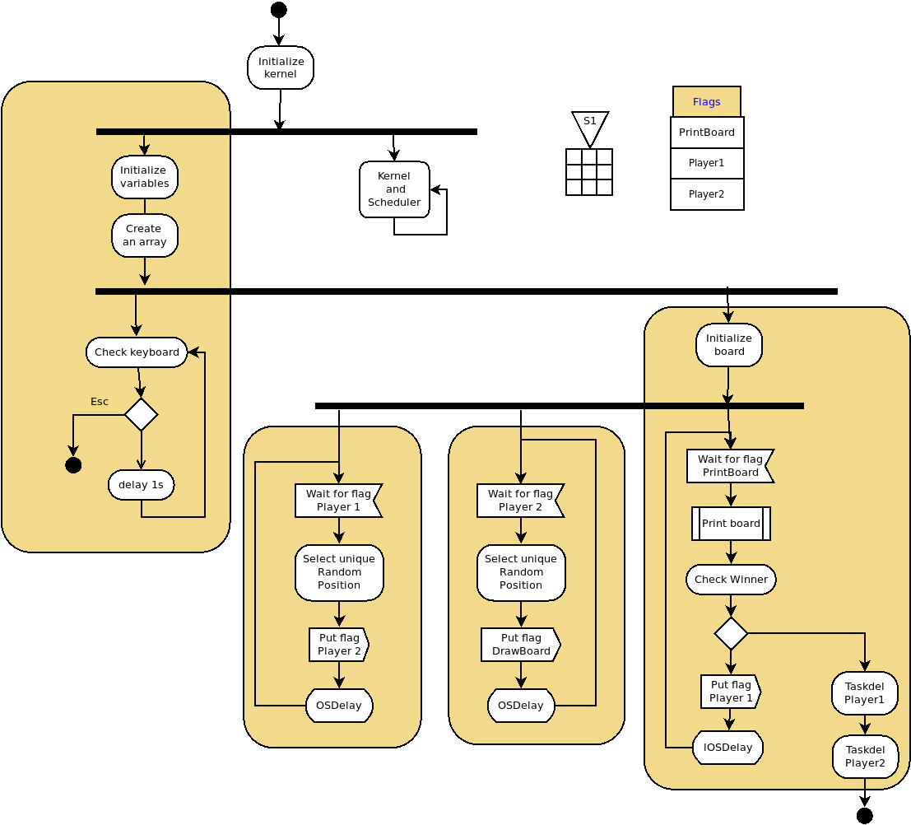
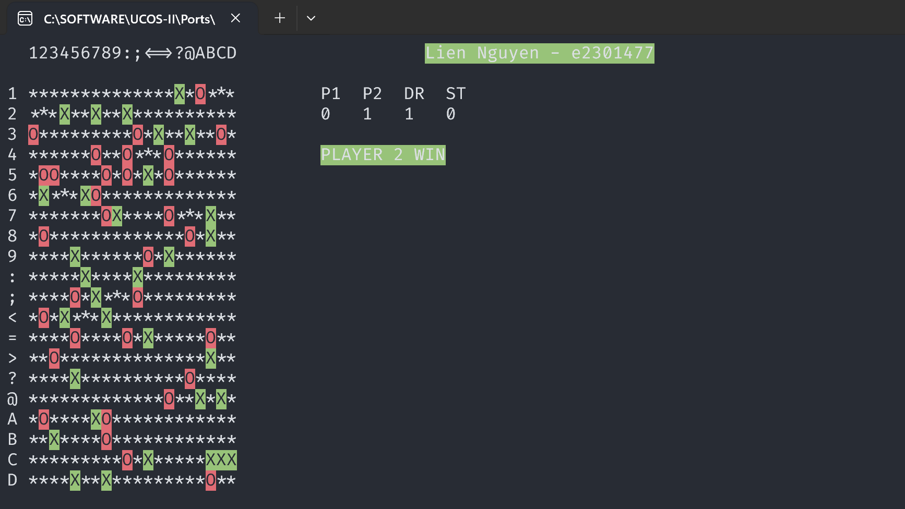

# Real-Time Game TikTakToe 2 robot play with each other using uCOS-II

## Overview
This project demonstrates a real-time multiplayer game (similar to Connect 4) using the uC/OS-II real-time kernel. Two players take turns placing their marks (`O` for Player 1, `X` for Player 2) on a 20x20 grid. The game checks for a winner when four consecutive marks align (horizontally, vertically, or diagonally). The game leverages multitasking, event flags, and synchronization mechanisms provided by uC/OS-II.

---

## Prerequisites
- **uC/OS-II** environment with a Win32 or Linux port (e.g., `Werner.Zimmermann@fht-esslingen.de` port).
- Compiler supporting the uC/OS-II kernel and PC-specific display functions (e.g., Borland C++, GCC with DOS/Windows libraries).
- `includes.h` header containing uC/OS-II and platform-specific dependencies.

---

## Key Features
- **Real-Time Multitasking**: Tasks for board rendering, player moves, and game logic.
- **Automated Players**: Players make random valid moves (no human input).
- **Win Detection**: Checks for 4 consecutive marks in any direction.
- **Status Display**: Shows active flags (player turns, draw status).
- **Termination**: Game ends when a player wins or ESC is pressed.

---

## How to Run
- Download source_code/Demo.exe and run on window 64bit.
- You can build Makefile from source code. Will update step by step later.

---

## Gameplay
- **Board**: 20x20 grid initialized with `*` (empty cells).
- **Players**: 
  - Player 1 (`O`) starts first.
  - Players take turns placing marks randomly.
- **Winning Condition**: First player to align 4 marks wins.
- **Exit**: Press `ESC` to terminate the game.

---

## Code Structure
### Tasks
- **`TaskStart`**: Initializes the game, creates all tasks.
- **`DrawBoard`**: Renders the board and updates marks.
- **`TaskPLAYER_1`/`TaskPLAYER_2`**: Automate player moves.
- **`CheckFlagStatus`**: Displays current game flags (player turn, draw status).

### Key Functions
- **`Check_Winner`**: Scans the board for winning patterns.
- **`PlayerMove`**: Generates random valid moves for players.
- **`UpdateBoard`**: Refreshes the display with latest moves.
- **`Check_Keyboard`**: Listens for ESC key to exit.

### Events & Flags
- **`GameLogic` (Flag Group)**: Manages game state:
  - `PLAYER_1`: Player 1's turn.
  - `PLAYER_2`: Player 2's turn.
  - `DRAW`: Request to redraw the board.
  - `STATUS`: Update flag status display.
- **Semaphores**: Synchronize task execution.

---

## Logic

---

## Demo

---
